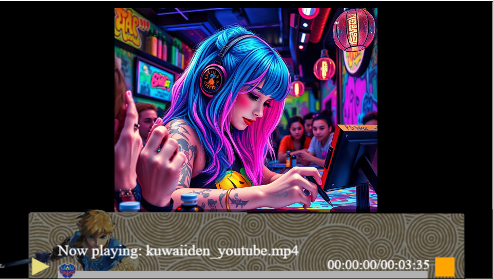
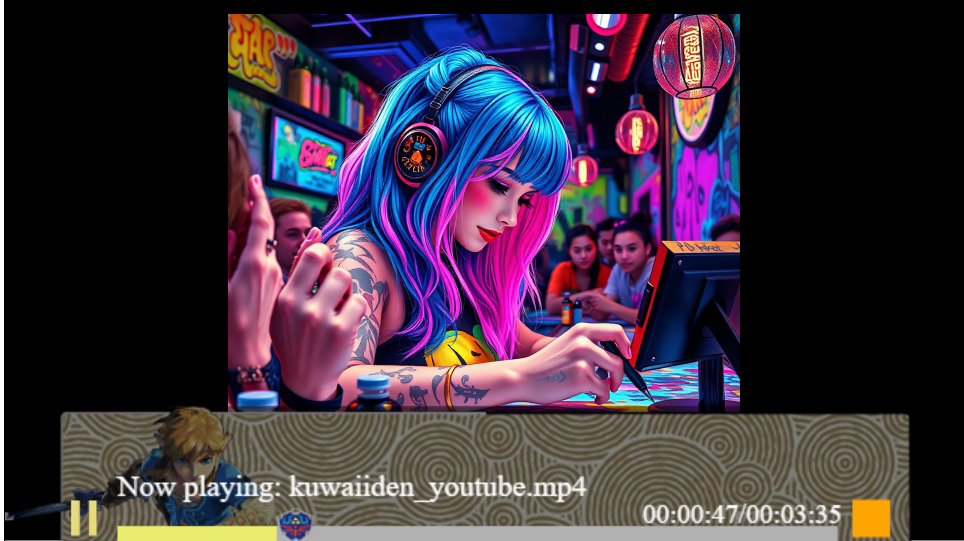
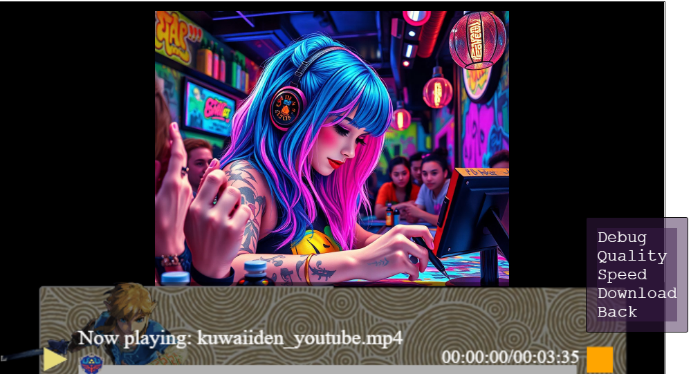

# Purpose
I'm tired of dumb media players not working or not having certain controls. I'm gonna make my own so it can have everything I want. 

# Setup Guide
1. Clone repository
2. Open folder in VSCode
3. Run `index.html` in a live server.*

*Live Server extension: (ritwickdey.LiveServer)

# Examples

